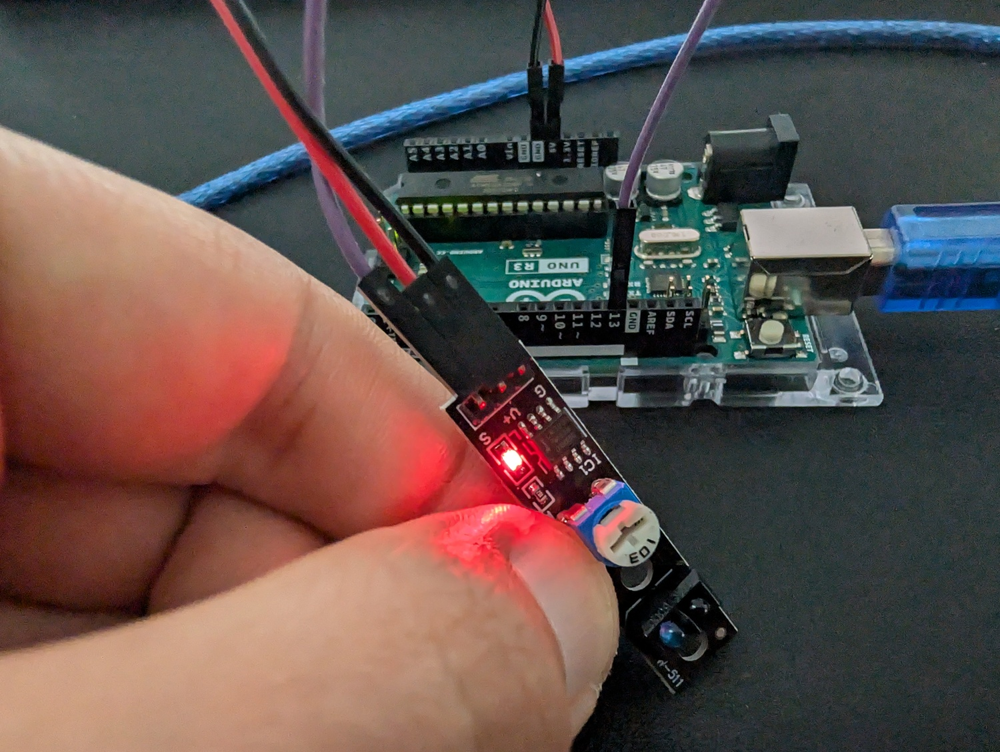

# Versuch: Linnienfolger Sensor

## Material
- 1x Arduino UNO
- 1x KY-033 Ultraschallsensor
- 3x Jumper Wire Female to Female
- 1x Laptop mit Software TODO
- 1x USB A zu B Kabel (Laptop zu Arduino UNO)

## Versuchsaufbau

### Hardwareaufbau


### Funktionsweise
Der KY-033 Liniensensor arbeitet mit einem Infrarot-Emitter und einem Empfänger. Der Emitter sendet kontinuierlich Infrarotlicht aus, während der Empfänger dieses aufnimmt, sobald es von einer Oberfläche reflektiert wird. Wenn der Sensor eine hohe Menge an reflektiertem Licht aufnimmt, bedeutet das in der Regel, dass er sich über einer hellen oder weißen Fläche befindet und daher nicht über einer Linie ist. Im Gegensatz dazu, wenn der Sensor über einer dunklen oder schwarzen Fläche positioniert ist, nimmt der Empfänger weniger Licht auf. Das signalisiert dem Sensor, dass er sich über einer Linie befindet. Daher erkennt der KY-033 Liniensensor Linien durch Messung der Menge an reflektiertem Infrarotlich.

### Ausgabebeispiel

``` text
Linie erkannt: 1
Linie erkannt: 1
Linie erkannt: 1
Linie erkannt: 1
Linie erkannt: 0
Linie erkannt: 0
Linie erkannt: 0
```
