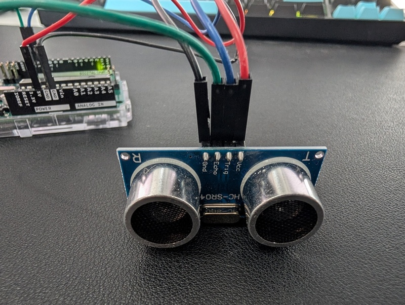
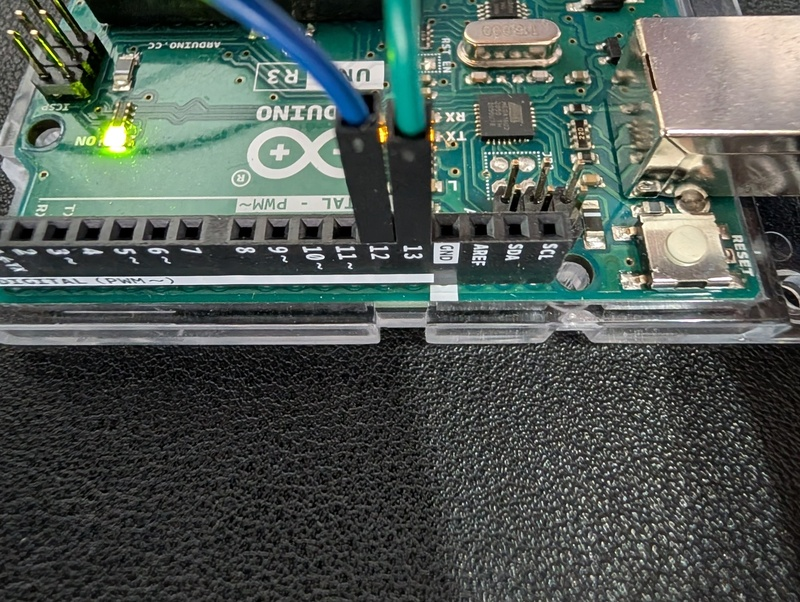

# Versuch: Ultraschall Sensor

## Material
- 1x Arduino UNO
- 1x HC-SR04 Ultraschallsensor
- 4x Jumper Wire Male to Male
- 1x Laptop mit Software TODO
- 1x USB A zu B Kabel (Laptop zu Arduino UNO)

## Versuchsaufbau

### Gesamtaufbau


### Anschluss Sensor


### Anschluss Arduino



### Ausgabebeispiel

``` text
---- Neue Messung
Dauer 1-Strecke in Mikrosekunden: 141
Dauer 1-Strecke in Sekunden: 0.0001410
Schallgeschwindigkeit (m/s): 343.50
Distanz: 4.84 cm
---- Neue Messung
Dauer 1-Strecke in Mikrosekunden: 1005
Dauer 1-Strecke in Sekunden: 0.0010050
Schallgeschwindigkeit (m/s): 343.50
Distanz: 34.52 cm
---- Neue Messung
Dauer 1-Strecke in Mikrosekunden: 480
Dauer 1-Strecke in Sekunden: 0.0004800
Schallgeschwindigkeit (m/s): 343.50
Distanz: 16.49 cm
---- Neue Messung
Dauer 1-Strecke in Mikrosekunden: 856
Dauer 1-Strecke in Sekunden: 0.0008560
Schallgeschwindigkeit (m/s): 343.50
Distanz: 29.40 cm
```
